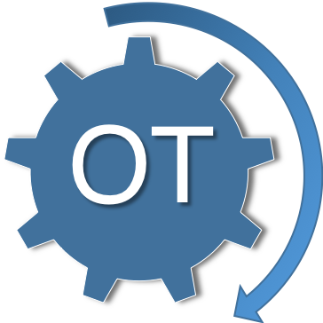
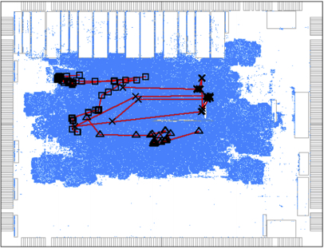
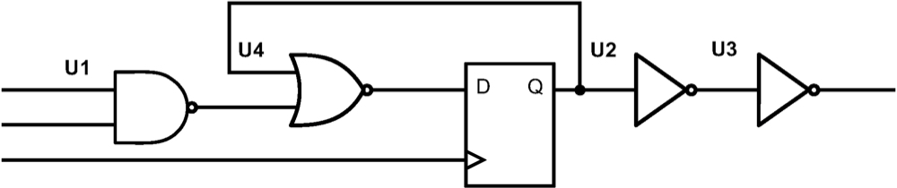
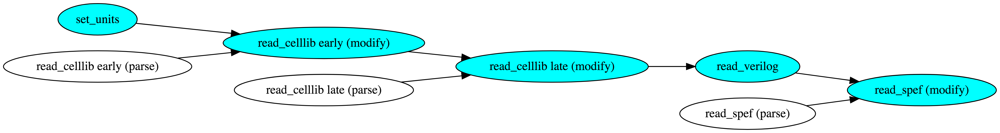
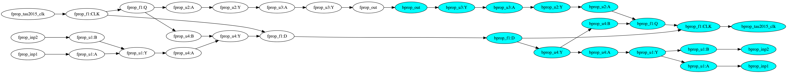
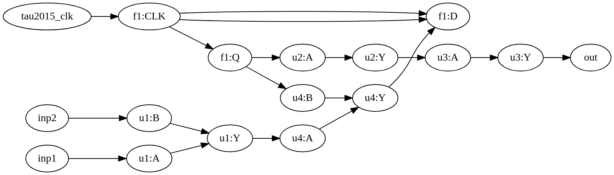
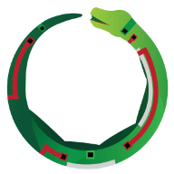

# OpenTimer 

[](https://travis-ci.org/OpenTimer/OpenTimer)
[](https://en.wikipedia.org/wiki/C%2B%2B#Standardization)
[](https://github.com/OpenTimer/OpenTimer/archive/master.zip)
[](https://github.com/OpenTimer/OpenTimer/tree/master)
[][Github issues]
[][OpenTimer Wiki]
[](./LICENSE)

A High-Performance Timing Analysis Tool for VLSI Systems

# Why OpenTimer?



OpenTimer is a new [static timing analysis (STA)][STA] tool to help IC designers
quickly verify the circuit timing.
It is developed completely from the ground up using *C++17*
to efficiently support parallel and incremental timing. 
Key features are:

+ Industry standard format (.lib, .v, .spef, .sdc) support
+ Graph- and path-based timing analysis
+ Parallel incremental timing for fast timing closure
+ Award-winning tools and golden timers in CAD Contests


# Get Started with OpenTimer

The easiest way to start using OpenTimer is to use *OpenTimer shell*.
OpenTimer shell is a powerful tool for interactive analysis
and the simplest way to learn core functionalities.
[Compile OpenTimer](#compile-opentimer) and launch the shell program `ot-shell`
under the `bin` directory.

```bash
~$ ./bin/ot-shell
  ____              _______              
 / __ \___  ___ ___/_  __(_)_ _  ___ ____
/ /_/ / _ \/ -_) _ \/ / / /  ' \/ -_) __/
\____/ .__/\__/_//_/_/ /_/_/_/_/\__/_/       v2.0.0 (alpha)
    /_/                                     
MIT License: type "license" to see more details.
For help, type "help".
For bug reports, issues, and manual, please see:
<https://github.com/OpenTimer/OpenTimer>.
ot> 
```

We have provided a [simple design](./example/simple)
which consists of five gates (one NAND, one NOR, two INV, one FF) and one clock. 
Move to the folder and read this simple design.



```bash
ot> cd example/simple
ot> read_celllib osu018_stdcells.lib
ot> read_verilog simple.v   
ot> read_sdc simple.sdc
```

Report the timing to show the most critical path.

```text
ot> report_timing      # report the most critical path
Startpoint    : inp1
Endpoint      : f1:D
Analysis type : min
------------------------------------------------------
       Type       Delay        Time   Dir  Description
------------------------------------------------------
       port       0.000       0.000  fall  inp1
        pin       0.000       0.000  fall  u1:A (NAND2X1)
        pin       2.786       2.786  rise  u1:Y (NAND2X1)
        pin       0.000       2.786  rise  u4:A (NOR2X1)
        pin       0.181       2.967  fall  u4:Y (NOR2X1)
        pin       0.000       2.967  fall  f1:D (DFFNEGX1)
    arrival                   2.967        data arrival time

related pin      25.000      25.000  fall  f1:CLK (DFFNEGX1)
 constraint       1.518      26.518        library hold_falling
   required                  26.518        data required time
------------------------------------------------------
      slack                 -23.551        VIOLATED
```

The critical path originates from the primary input `inp1` and 
feed into the data pin `f1:D` of the flip-flop `DFFNEGX1`.

# Compile OpenTimer

## System Requirements

OpenTimer is very self-contained and has very few dependencies.
To compile OpenTimer, you need a [C++17][C++17] compiler. 
We currently support:

+ GNU C++ Compiler v7.3 with -std=c++1z
+ Clang C++ Compiler v6.0 with -std=c++17

In addition, you need a tcl shell interpreter:

+ [tclsh](https://www.tcl.tk/about/language.html) 
(most Unix/Linux/OSX distributions already include tclsh)

OpenTimer has been tested to run well on Linux distributions and MAC OSX.

## Build through CMake

We use [CMake](https://cmake.org/) to manage the source and tests.
We recommend using out-of-source build.

```bash
~$ git clone https://github.com/OpenTimer/OpenTimer.git
~$ cd OpenTimer
~$ mkdir build
~$ cd build
~$ cmake ../
~$ make 
```

After successful build, you can find binaries and libraries in the folders `bin` 
and `lib`, respectively.

## Run Tests
OpenTimer uses [Doctest](https://github.com/onqtam/doctest) for unit tests and
[TAU15][TAU15] benchmarks for integration/regression tests. These benchmarks are generated by an 
industry standard timer and are being used by many EDA researchers.

```bash
~$ make test
```

# Design Philosophy

OpenTimer has a unique software architecture to
efficiently enable parallel incremental timing.
We draw two levers on *performance* and *useability*
by grouping each timing operation to one of the three categories,
*builder*, *action*, and *accessor*.

| Type |  Description | Example | Time Complexity |
| -------  |  ----------- |  --- | -- |
| Builder  | create lazy tasks to build an analysis framework | read_celllib, insert_gate, set_slew | O(1) |
| Action   | carry out builder operations to update the timing | update_timing, report_timing, report_slack | Algorithm-dependent |
| Accessors| inspect the timer without changing any internal data structures | dump_timer, dump_slack, dump_net_load | Operation-dependent |

## Builder: OpenTimer Lineage

OpenTimer maintains a lineage graph of *builder* operations 
to create a *task execution plan* (TEP).
A TEP starts with no dependency and keeps adding tasks to the lineage graph
every time you call a builder operation.
It records what transformations need to be executed 
when an action has been called.




The above figure shows an example
lineage graph of a sequence of builder operations.
The cyan path is the main lineage line 
with additional tasks attached to enable parallel execution.
OpenTimer use [Cpp-Taskflow][Cpp-Taskflow] to create dependency graphs.

## Action: Update Timing

A TEP is materialized and executed when the timer is requested to perform 
an *action* operation.
Each action operation triggers timing update
from the earliest task to the one that produces the result
of the action call.
Internally, OpenTimer creates task dependency graph to update timing in parallel,
including forward (slew, arrival time) 
and backward (required arrival time) propagations.



The figure above shows the dependency graph (forward in white, backward in cyan) 
to update the timing of the 
[simple](example/simple/simple.v) design.
When an action call finishes, it cleans out the lineage graph
with all timing up-to-date.

## Accessor: Inspect OpenTimer

The *accessor* operations let you inspect the timer status and dump timing information.
All accessor operations are declared as *const methods* in the timer class. 
Calling them promises not to alter any internal members.
For example, you can dump the timing graph into a DOT format and use tools like [GraphViz][GraphViz]
for visualization.



```bash
ot> dump_graph  
digraph TimingGraph {
  "inp1";
  ...  # skip for short
  "f1:CLK" -> "f1:Q";
  "u1:B" -> "u1:Y";
  "u1:A" -> "u1:Y";
}
```

# OpenTimer Shell

OpenTimer shell is a powerful command line tool to perform interactive analysis.
It is also the easiest way to get your first timing report off the ground.
The program `ot-shell` can be found in the folder `bin/` after you 
[Compile OpenTimer](#compile-opentimer).

## Commands

The table below shows a list of commonly used commands.

| Command | type | Arguments | Description | Example |
| ------- | ---- | --------- | ----------- | ------- |
| read_celllib | builder | [-min \| -max] file | read the cell library for early and late splits | read_celllib mylib.lib |
| read_verilog | builder | file | read the verilog netlist | read_verilog mynetlist.v |
| read_spef | builder | file | read parasitics in SPEF | read_spef myparasitics.spef |
| read_sdc | builder | file | read a Synopsys Design Constraint file | read_sdc myrule.sdc |
| update_timing | action | none | update the timing | update_timing |
| report_timing | action | [-num_paths k] | report the critical paths | report_timing -num_paths 10 |
| report_tns | action | none | report the total negative slack | report_tns |
| report_wns | action | none | report the worst negative slack | report_wns |
| dump_graph | accessor | [-o file] | dump the timing graph to a DOT format | dump_graph |
| dump_timer | accessor | [-o file] | dump the design statistics | dump_timer |

To see the full command list, visit [OpenTimer Wiki][OpenTimer Wiki].

# Integrate OpenTimer to your Project

There are a number of ways to develop your project on top of OpenTimer.

## Option 1: Add OpenTimer Subproject

The easiest way to build an OpenTimer application is to include it as a subproject
using CMake [add_subdirectory](https://cmake.org/cmake/help/latest/command/add_subdirectory.html).
Copy OpenTimer to your project root directory and configure your CMakeLists 
[as follows](doc/CMakeLists-Subproject.template):

```CMake
cmake_minimum_required (VERSION 3.9)                  # CMake minimum version
project(app)                                          # your OpenTimer application
add_subdirectory(OpenTimer)                           # add OpenTimer project
include_directories(${PROJECT_SOURCE_DIR}/OpenTimer)  # add OpenTimer include

set(CMAKE_CXX_STANDARD 17)                            # enable c++17
set(CMAKE_CXX_STANDARD_REQUIRED ON)

find_package(Threads REQUIRED)                        # thread library (pthread)

add_executable(app app.cpp)                           # link to your app.cpp
target_link_libraries(app OpenTimer Threads::Threads stdc++fs)
```

## Option 2: Install OpenTimer 

Our project [CMakeLists.txt](CMakeLists.txt) has defined the required files
to install when you hit `make install`.
The installation paths are `<prefix>/include`, `<prefix>/lib`, and `<prefix>/bin`
for the hpp files, library, and executable where `<prefix>` can be configured 
through the cmake variable [CMAKE_INSTALL_PREFIX](https://cmake.org/cmake/help/latest/variable/CMAKE_INSTALL_PREFIX.html#variable:CMAKE_INSTALL_PREFIX).
The following example installs OpenTimer to `/tmp`.

```bash
~$ cd build/
~$ cmake ../ -DCMAKE_INSTALL_PREFIX=/tmp
~$ make 
~$ make install
~$ cd /tmp            # install OpenTimer to /tmp
~$ ls
bin/  include/  lib/  # OpenTimer headers, libraries, and binaries
```

To build your application on top of the OpenTimer headers and library,
you need `-std=c++1z` and `-lstdc++fs` flags
to enable C++17 standard and [filesystem](https://en.cppreference.com/w/cpp/experimental/fs) libraries.

```bash
~$ g++ app.cpp -std=c++1z -O2 -I include -L lib -lOpenTimer -lpthread -o app.out "-lstdc++fs "
~$ ./app.out
```

# OpenTimer C++ API

The class [Timer](ot/timer/timer.hpp) is the main entry you need to 
call OpenTimer in your project. 
The table below summarizes a list of commonly used methods.

| Method | Type | Argument | Return | Description |
| ------ | ---- | -------- | ------ | ----------- |
| read_celllib| builder | path, split | self | read the cell library for early and late splits |
| read_verilog| builder | path | self | read a verilog netlist |
| read_spef   | builder | path | self | read parasitics in SPEF |
| read_sdc    | builder | path | self | read a Synopsys Design Constraint file |
| update_timing | action | void | void | update the timing; all timing values are up-to-date upon return |
| tns | action | void | optional of float | update the timing and return the total negative slack if exists |
| wns | action | void | optional of float | update the timing and return the worst negative slack if exists |
| dump_graph | accessor | ostream | void | dump the timing graph in DOT format to an output stream |
| dump_timer | accessor | ostream | void | dump the design statistics to an output stream |


*All public methods are thread-safe* as a result of OpenTimer lineage.
The example below shows an OpenTimer application and the use of builder, action, and accessor API.

```cpp
#include <ot/timer/timer.hpp>                     // top-level header to include

int main(int argc, char *argv[]) {
  
  ot::Timer timer;                                // create a timer instance (thread-safe)
  
  timer.read_celllib("simple.lib", std::nullopt)  // read the library (O(1) builder)
       .read_verilog("simple.v")                  // read the verilog netlist (O(1) builder)
       .read_spef("simple.spef")                  // read the parasitics (O(1) builder)
       .read_sdc("simple.sdc")                    // read the design constraints (O(1) builder)
       .update_timing();                          // update timing (O(1) builder)

  if(auto tns = timer.report_tns(); tns) std::cout << "TNS: " << *tns << '\n';  // (O(N) action)
  if(auto wns = timer.report_wns(); wns) std::cout << "WNS: " << *wns << '\n';  // (O(N) action)
  
  timer.dump_timer(std::cout);                    // dump the timer details (O(1) accessor)
  
  return 0;
}
```

To see the full API list, visit [OpenTimer Wiki][OpenTimer Wiki].

# Examples

The folder [example](./example) contains several examples and is a great place to learn how to use OpenTimer.

| Example |  Description | Library |
| ------- |  ----------- | ---- |
| [simple](./example/simple) | A timing report example on a sequential circuit design. | [OSU Free PDK 45nm][OSUPDK] |
| [incremental](./example/incremental) | An incremental timing example to create a sequential design from the ground up using OpenTimer's C++ API | [OSU Free PDK 45nm][OSUPDK] |
| [unit](./example/unit) | A dimensional analysis example with different time unit conversions. | [OSU Free PDK 45nm][OSUPDK] |
| [sizer](./example/sizer) | A gate-sizing example on a design with six NAND2 cells. | [NanGate 45nm Open Cell Library][NanGate] |
| [optimizer](./example/optimizer) | A timing-driven optimization example plus incremental timing update. | [TAU15 contest library][TAU15] |

The folder [benchmark](./benchmark) contains more designs and they are mainly used for internal regression 
and integration tests.


# Who is Using OpenTimer?

OpenTimer is an award-winning tools. It won ACM TAU Timing Analysis Contests multiple times
([1st Place][TAU14] in 2014, [2nd Place][TAU15] in 2015, and [1st Place][TAU16] in 2016),
the [Special Price][LibreCores] in the 2016 LibreCores Design Contest,
and the Best Tool Winner in the 2018 [WOSET][WOSET18] at ICCAD.
Many industry and academic people are using OpenTimer in their projects:

- [Golden Timer][TAU19], 2019 ACM TAU Timing Analysis Contest on Timing-driven Optimization
- [Golden Timer][TAU18], 2018 ACM TAU Timing Analysis Contest on Timing Reports from an STA Graph
- [Golden Timer][TAU17], 2017 ACM TAU Timing Analysis Contest on Micro Modeling
- [Golden Timer][TAU16], 2016 ACM TAU Timing Analysis Contest on Micro Modeling
- [Golden Timer][ICCAD15], 2015 ACM/IEEE ICCAD Incremental Timing-driven Placement Contest
- [VSD][VSD]: VLSI System Design Corporation
- [OpenDesign Flow Database][OpenDesign]: the infrastructure for VLSI design and design automation research
- [CloudV][CloudV]: a cloud-based platform to design and test chips for free
- [LGraph][LGraph]: live graph infrastructure for synthesis and simulation
- [Qflow][Qflow]: a digital synthesis flow using open-source EDA tools
- [Ophidian][Ophidian]: an open-source library for physical design research and teaching

| [][TAU16] | [][TAU17]| [][TAU18] | [][TAU19]  | [][ICCAD15] | [][VSD] | [][Ophidian] | [][CloudV] | [][LGraph] | [][Qflow] |
| :---: | :---: | :---: | :---: | :---: | :---: | :---: | :---: | :---: | :---: |


Please don't hesitate to [let me know][email me] if I forgot your project! 


# Get Involved

+ Report bugs/issues by submitting a [Github issue][Github issues].
+ Submit contributions using [pull requests][Github pull requests].
+ See documentation and manual in [OpenTimer Wiki][OpenTimer Wiki].
+ Stay tuned with our [project progress][Github projects].
+ Read and cite our [ICCAD][OpenTimerPaper] and [TCAD][UI-TimerPaper] papers.

# Contributors & Acknowledgment

OpenTimer is being actively developed and contributed by the following people:
- [Tsung-Wei Huang][Tsung-Wei Huang] created the OpenTimer project is now the chief architect.
- [Martin Wong][Martin Wong] supported the OpenTimer project through NSF and DARPA funding.
- [Andreas Olofsson][Andreas Olofsson] supported the OpenTimer project through the DARPA IDEA project.
- [Chun-Xun Lin][Chun-Xun Lin] implemented the prompt interface of OpenTimer shell.
- [Kunal Ghosh][Kunal Ghosh] provided a list of practical features to include in OpenTimer.
- [Pei-Yu Lee][Pei-Yu Lee] provided useful incremental timing discussion and helped fix bugs.
- [Tin-Yin Lai][Tin-Yin Lai] discussed micro modeling algorithms and helped fix bugs.
- [Jin Hu][Jin Hu] helped define the timing API and produced the golden benchmarks for integration tests.
- [Myung-Chul Kim][Myung-Chul Kim] helped test OpenTimer through ICCAD CAD contest.
- [George Chen][George Chen] helped defined path report formats and test OpenTimer through TAU contest.
- [Jignesh Shah][Jignesh Shah] contributed to the area and power report commands.
- [Pao-I Chen][Pao-I Chen] helped design the logo of OpenTimer.
- [Leslie Hwang][Leslie Hwang] reviewed the documentation and README.
- [Song Chen][Song Chen] shared his opinion about command designs to avoid naming conflicts and litigation.

<!--

| [][Tsung-Wei Huang] | [][Martin Wong] | [][Chun-Xun Lin] | [][Kunal Ghosh] | [][Pei-Yu Lee] | [][Jin Hu] | [][Myung-Chul Kim] |
| :---: | :---: | :---: | :---: | :---: | :---: | :---: |
| [][George Chen]| [][Pao-I Chen] |
-->

Meanwhile, we appreciate the support from many organizations for our development of OpenTimer.
Please don't hesitate to [let me know][email me] if I forgot you! 

| [][UIUC] | [][CSL] | [][NSF] | [][DARPA IDEA] | [][VSD] |
| :---: | :---: | :---: | :---: | :---: |


# License


OpenTimer is licensed under the [MIT License](./LICENSE):

>Copyright &copy; 2018 [Dr. Tsung-Wei Huang][Tsung-Wei Huang] and [Dr. Martin Wong][Martin Wong]
>
>The University of Illinois at Urbana-Champaign, IL, USA
>
>Permission is hereby granted, free of charge, to any person obtaining a copy of this software and associated documentation files (the “Software”), to deal in the Software without restriction, including without limitation the rights to use, copy, modify, merge, publish, distribute, sublicense, and/or sell copies of the Software, and to permit persons to whom the Software is furnished to do so, subject to the following conditions:
>
>The above copyright notice and this permission notice shall be included in all copies or substantial portions of the Software.
>
>THE SOFTWARE IS PROVIDED “AS IS”, WITHOUT WARRANTY OF ANY KIND, EXPRESS OR IMPLIED, INCLUDING BUT NOT LIMITED TO THE WARRANTIES OF MERCHANTABILITY, FITNESS FOR A PARTICULAR PURPOSE AND NONINFRINGEMENT. IN NO EVENT SHALL THE AUTHORS OR COPYRIGHT HOLDERS BE LIABLE FOR ANY CLAIM, DAMAGES OR OTHER LIABILITY, WHETHER IN AN ACTION OF CONTRACT, TORT OR OTHERWISE, ARISING FROM, OUT OF OR IN CONNECTION WITH THE SOFTWARE OR THE USE OR OTHER DEALINGS IN THE SOFTWARE.

---

The core of OpenTimer is under MIT license. However, it is built, tested, and documented
using several third-party tools and services. Thanks a lot!
+ [units][units]: a compile-time header-only dimensional analysis and unit conversion
+ [Parser-SPEF][Parser-SPEF]: a fast C++ header-only parser for standard parasitic exchange format (SPEF)
+ [PEGTL][PEGTL]: parsing expression grammar template library
+ [Cpp-Taskflow][Cpp-Taskflow]: fast C++ parallel programming with task dependencies
+ [NanGate 45nm Library][NanGate]: open-source standard-cell library for testing and exploring EDA flows
+ [OSU PDK][OSUPDK]: Oklahoma State University system on chip (SoC) design flows
+ [Synopsys TAP-in][Synopsys Tap-in]: Synopsys technology access program for liberty user guide and open-source SDC parser.

You can find a copy of these licenses under the folder [licenses](licenses).

* * *

[STA]:                   https://en.wikipedia.org/wiki/Static_timing_analysis
[Tsung-Wei Huang]:       https://twhuang.ece.illinois.edu/
[Chun-Xun Lin]:          https://github.com/clin99
[Martin Wong]:           https://ece.illinois.edu/directory/profile/mdfwong
[Andreas Olofsson]:      https://github.com/aolofsson
[Kunal Ghosh]:           mailto:kunalpghosh@gmail.com
[Jin Hu]:                mailto:jinhu@umich.edu
[Myung-Chul Kim]:        mailto:mckima@us.ibm.com
[Tin-Yin Lai]:           mailto:tinyinlai@gmail.com
[Pei-Yu Lee]:            mailto:palacedeforsaken@gmail.com
[George Chen]:           mailto:george@geochrist.com
[Jignesh Shah]:          mailto:jignesh.shah@intel.com
[Pao-I Chen]:            mailto:poyipenny@gmail.com
[Leslie Hwang]:          mailto:tkdlezz@gmail.com 
[Song Chen]:             mailto:song.chen@synopsys.com
[Github releases]:       https://github.com/OpenTimer/OpenTimer/releases
[Github issues]:         https://github.com/OpenTimer/OpenTimer/issues
[Github pull requests]:  https://github.com/OpenTimer/OpenTimer/pulls
[Github projects]:       https://github.com/OpenTimer/OpenTimer/projects
[Github insights]:       https://github.com/OpenTimer/OpenTimer/pulse
[GraphViz]:              https://dreampuf.github.io/GraphvizOnline/
[OpenTimer Wiki]:        ./wiki/home.md
[OpenTimer-1.0]:         https://web.engr.illinois.edu/~thuang19/software/timer/OpenTimer.html
[OpenTimerCitation]:     https://scholar.google.com/scholar?oi=bibs&hl=en&cites=142282068238605079
[OpenTimerPaper]:        doc/iccad15.pdf
[UI-TimerPaper]:         doc/tcad16.pdf
[email me]:              mailto:twh760812@gmail.com
[VSD]:                   https://www.vlsisystemdesign.com/
[ICCAD15]:               http://cad-contest.el.cycu.edu.tw/problem_C/default.html
[TAU14]:                 https://sites.google.com/site/taucontest2014/
[TAU15]:                 https://sites.google.com/site/taucontest2015/
[TAU16]:                 https://sites.google.com/site/taucontest2016/
[TAU17]:                 https://sites.google.com/site/taucontest2017/
[TAU18]:                 https://sites.google.com/view/taucontest2018/
[TAU19]:                 https://sites.google.com/view/tau-contest-2019/home
[WOSET18]:               https://woset-workshop.github.io/
[LibreCores]:            https://fossi-foundation.org/2016/10/13/designcontest
[OpenDesign]:            https://github.com/jinwookjungs/open_design_flow
[CloudV]:                https://cloudv.io/
[LGraph]:                https://github.com/masc-ucsc/lgraph
[Qflow]:                 http://opencircuitdesign.com/qflow/history.html
[Ophidian]:              https://gitlab.com/eclufsc/ophidian
[DARPA IDEA]:            https://www.darpa.mil/news-events/2017-09-13
[NSF]:                   https://www.nsf.gov/
[UIUC]:                  https://illinois.edu/
[CSL]:                   https://csl.illinois.edu/
[C++17]:                 https://en.wikipedia.org/wiki/C%2B%2B17
[units]:                 https://github.com/nholthaus/units
[PEGTL]:                 https://github.com/taocpp/PEGTL
[Parser-SPEF]:           https://github.com/OpenTimer/Parser-SPEF         
[Cpp-Taskflow]:          https://github.com/cpp-taskflow/cpp-taskflow
[NanGate]:               http://www.nangate.com/?page_id=22
[OSUPDK]:                https://vlsiarch.ecen.okstate.edu/flow/
[Synopsys TAP-in]:       https://www.synopsys.com/community/interoperability-programs/tap-in.html
 
