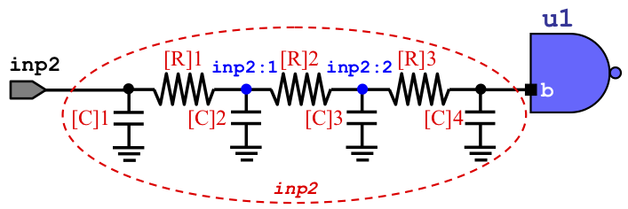

# Standard Parasitic Exchange Format (SPEF)

OpenTimer reads parasitics of a net set as a resistive-capacitive (RC) network. 
Each RC network is described in a [Standard Parasitic Exchange Format (SPEF)][SPEF Wiki] file.
If the connection does not have parasitics, then the delay is zero and the output
slew is euqal to the input slew.

# Admissible SPEF Format

OpenTimer can parse pretty much a complete SPEF netlist.
We use the open-source project [Parser-SPEF][Parser-SPEF] to parse a SPEF file.
Each SPEF file contains:
1. header section
2. name map section
3. port section 
4. parasitics section

```spef
// begin header (14 lines)
*SPEF <string>
*DESIGN <string>
*DATE <string>
*VENDOR <string>
*PROGRAM <string>
*VERSION <string>
*DESIGN_FLOW <string>
*DIVIDER <string>
*DELIMITER <string>
*BUS_DELIMITER <string>
*T_UNIT <int> <string>
*C_UNIT <int> <string>
*R_UNIT <int> <string>
*L_UNIT <int> <string>

// name-map section
*NAME_MAP
*1 node_name_1
*2 node_name_2
*3 node_name_3
...

// port section
port_name_1 direction
...

// parasitics section
*D_NET net_name total_net_capacitance
*CONN
pin_type pin_name pin_direction
... 
*CAP
integer_label node_name node_capacitance
...
*RES
integer_label node_name node_name node_resistance
...
*END
```

## Example

The example below demonstrates a valid SPEF file for OpenTimer.

```
*SPEF "IEEE 1481-1998"
*DESIGN "simple"
*DATE "Tue Aug 30 09:15:30 2017"
*VENDOR "OpenTimer"
*PROGRAM "OpenTimer"
*VERSION "0.0"
*DESIGN_FLOW "NETLIST_TYPE_VERILOG"
*DIVIDER /
*DELIMITER :
*BUS_DELIMITER [ ]
*T_UNIT 1 PS       // 1 pico second
*C_UNIT 1 FF       // 1 femto farad
*R_UNIT 1 KOHM     // 1 killo ohm
*L_UNIT 1 UH     

*NAME_MAP
*1 inp2            // replace all "*1" with inp2 hereafter

*D_NET *1 2.0      // *D_NET inp2 2.0
*CONN
*P *1 I            // *P inp2 I
*I u1:b I
*CAP
1 *1 0.2           // 1 inp2 0.2
2 *1:1 0.5         // 2 inp2:1 0.5
3 *1:2 0.4         // 3 inp2:2 0.4
4 u1:b 0.9
*RES
1 *1 *1:1 1.4      // 1 inp2 inp2:1 1.4
2 *1:1 *1:2 1.5    // 2 inp2:1 inp2:2 1.5
3 *1:2 u1:b 1.6    // 3 inp2:2 u1:b 1.6
*END
```

<p>

Parasitics of net inp2.
</p>


The example above defines a RC network `inp2` with a total lumped
capacitance of 2 femto farads (fF). The name mapped section defines:
+ `inp2` to be referred by its name or by \*1

The connection section defines:
+ Port pin `inp2` with input direction
+ Internal pin `u1:b` with input direction

`inp2` as a primary input port and `u1:b` as an internal input pin.
The capacitor section defines:
+ 0.2 fF capacitor between primary input pin `inp2` and `GND`
+ 0.5 fF capacitor between SPEF-specific intermediate node `inp2:1` and `GND`
+ 0.4 fF capacitor between SPEF-specific intermediate node `inp2:2` and `GND`
+ 0.9 fF capacitor between `u1:b` and `GND`

The resistor section defines:
+ 1.4 kOhm resistor between primary input pin `inp2` and `inp2:1`
+ 1.5 kOhm resistor between SPEF-specific intermediate nodes `inp2:1` and `inp2:2`
+ 1.6 kOhm resistor between SPEF-specific intermediate node `inp2:2` and `u1:b`


# Reference
1. [Standard Parasitic Exchange Format][SPEF Wiki]
2. [2015 ACM TAU Timing Analysis Contest][TAU15]

* * *

[SPEF Wiki]:    https://en.wikipedia.org/wiki/Standard_Parasitic_Exchange_Format
[Parser-SPEF]:  https://github.com/OpenTimer/Parser-SPEF
[TAU15]:        https://sites.google.com/site/taucontest2015/

