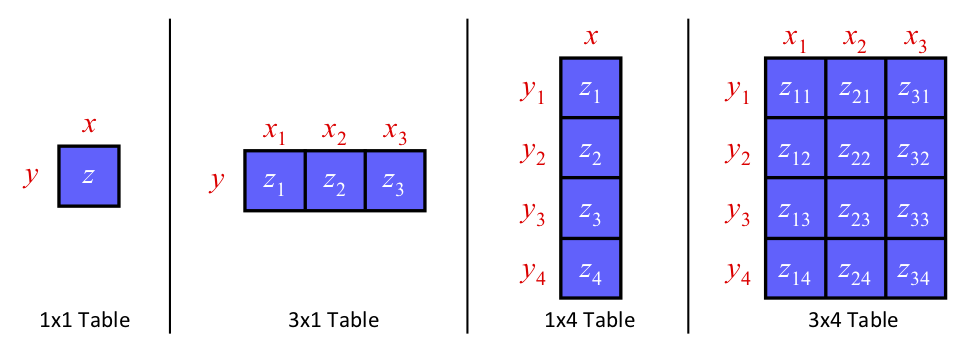

# Non-Linear Delay Model (NLDM)

OpenTimer supports *Non-Linear Delay Model (NLDM)*.
Most of the cell libraries include table models to specify the delays and timing checks
for various timing arcs of the cell.
The table models are referred to as NLDM,
and are used for delay, output slew, and timing tests.
NLDM captures the delay through the combination of input transition time at the cell input pin
and the total output capacitance at the cell output pin.

## How does NLDM Work in OpenTimer?

To give you a better idea about how OpenTimer works with NLDM,
let's start with an example of such a table for a typical inverter cell.

```text
cell ("INV_X1") {
  pin ("o") {
    direction : output ;
    capacitance : 0.0 ;
    max_capacitance : 12.80 ;
    min_capacitance : 0.00 ;
    timing() {
      cell_fall ("delay_template_5x5") {
        index_1 ("0.00,1.00,2.00,4.00,8.00") ;      // input transition
        index_2 ("5.00,30.00,50.00,80.00,140.00") ; // output capacitance
        values (\
          "9.376,  14.576, 18.136, 22.088, 27.856", \
          "13.544, 18.744, 22.88,  27.96,  35.32",  \
          "17.704, 22.904, 27.064, 32.992, 41.784", \
          "26.04,  31.24,  35.4,   41.64,  52.84",  \
          "42.704, 47.904, 52.064, 58.304, 70.784"  \
        );
      }
      cell_rise ("delay_template_5x5") {
        index_1 ("0.00,1.00,2.00,4.00,8.00") ;      // input transition
        index_2 ("5.00,30.00,50.00,80.00,140.00") ; // output capacitance
        values (\
          "9.376,  14.576, 18.136, 22.088, 27.856", \
          "13.544, 18.744, 22.88,  27.96,  35.32",  \
          "17.704, 22.904, 27.064, 32.992, 41.784", \
          "26.04,  31.24,  35.4,   41.64,  52.84",  \
          "42.704, 47.904, 52.064, 58.304, 70.784"  \
        );
      }
      timing_sense : negative_unate ;
      related_pin  : "a" ;
    }
  }
}
```

The above example describes the delay of from the input pin `a` to the output pin `o`.
Two tables are defined for fall delay and rise delay at pin `o`,
labeled as `cell_fall` and `cell_rise`.
The type of indices and the order of lookup table indices are defined in the 
lookup table template `delay_template_5x5`.

```text
lu_table_template(delay_template_5x5) {
  variable_1 : input_net_transition;
  variable_2 : total_output_net_capacitance;
  index_1 ("1000, 1001, 1002");
  index_2 ("1000, 1001, 1002");
}
```

This lookup table template defines that the first variable is the input transition time
and the second variable is the output capacitance.
Based on the upon delay tables, an input fall transition time of 1.00 (library time unit)
and an output load of 30.00 (library capacitance unit) will correspond to the rise delay
of the inverter of 18.744 (library time unit).
For values outside the indices, we perform interpolation or extrapolation to obtain the resulting timing values.

## Table Lookup through Linear Interpolation and Extrapolation

The figure below demonstrates different timing lookup tables of scalar,
one dimension, and two dimensions.

 

If the table is of size 1x1 (single scalar value),
no interpolation is needed. 
Regardless of input `x` and `y`, the output value `z` is constant.

If the table is one-dimensional (1xn or mx1),
the output values depends on the non-scalar dimension.
For instance, in the above 1x4 table, if `y < y1`, 
the output value z is the linear extrapolation between `z1` and `z2`.
If `y2 ≤ y ≤ y3`, the output value `z` is the linear interpolation 
between `z2` and `z3`.
If `y > y4`, the output value `z` is the linear extrapolation 
between `z3` and `z4`.

If the table is two-dimensional, 
we perform linear interpolation or extrapolation on the x value first,
and then perform the linear interpolation or extrapolation on the y value.
For instance, in the above 3x4 table,
if `x2 < x < x3` and `y2 < y < y3`, 
we compute `z_first` by linear interpolation on `z22` and `z32`,
and `z_second` by linear interpolation on `z23` and `z33`.
Then we determine the output value z by linear interpolation on
`z_first` and `z_second`.

# Summary

NLDM is advantageous in its simplicity and speed to compute the delay through a timing arc.
However, it doesn't model the capacitance variation during transition.
As the feature size shrinks,
the effect of interconnect resistance can result in large inaccuracy 
since the waveforms become highly non-linear.
At 90nm and below, 
other delay models (e.g., CCS, ECSM, etc) 
are used in order to enable accuracy close to circuit simulation.

# Reference

1. [2015 ACM TAU Timing Analysis Contest][TAU15]

* * *

[TAU15]:        https://sites.google.com/site/taucontest2015/
